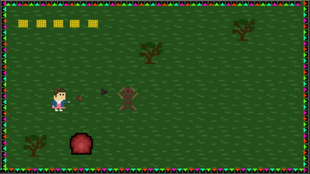
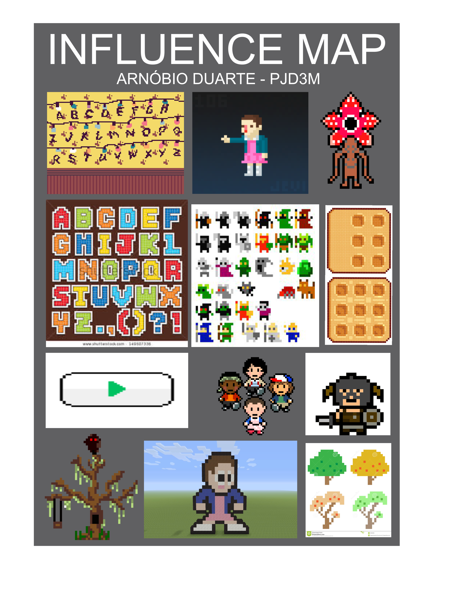

# Quem sou eu?
     
Arnóbio de Souza Duarte, 18.  
Técnico em Programação de Jogos Digitais (IFRN).  

Email: arnobiojunior2010@gmail.com  
[Instagram: arnobio_duarte](https://www.instagram.com/arnobio_duarte/)  
[Github: arnobioduarte05](https://github.com/arnobioduarte05)  

* * * 

# JOGOS

* [JOGO 1 - EXPLORE](https://thewordkh.github.io/Explore/)  
"Explore" coloca o jogador para imergir nas diversidades culturais das regiões do Brasil.

* [JOGO 2 - CASO 1070](https://leonardofelipe.github.io/CASO1070/)  
Este é um caso a ser desvendado com a ajuda das pistas deixadas em fitas cassetes dispostas no jogo.

* [JOGO 3 - CAPACETE BRANCO](https://zevictor.github.io/CapWhite/)  
Capacete Branco retrata os desastres de um típico país em pós-guerra. Ao final, o jogador poderá fazer uma doação ao International Rescue Committee para ajudar aos países que vivenciaram/vivenciam a guerra.

* * *

# JOGOS EM CONSTRUÇÃO
O jogo "011" está sendo feito com as artes em pixel art, na plataforma Construct. É baseado no seriado "Stranger Things".    
    

O jogo "Micro Guerra" está sendo feito para crianças. O objetivo é transferir conhecimentos sobre saúde bucal.  

* * *

MAPA DE INFLUÊNCIAS PARA AS ARTES (influence map)

* * * 
# PROJETO DE PESQUISA (EM EXECUÇÃO)  
Título do Projeto:  

O processo de abstração da forma aplicada ao desenho: Uma investigação para a melhoria da comunicação de ideias entre a etapa de concepção e a etapa de produção de personagens de jogos digitais.  

Resumo do projeto:  

Durante processo de criação de personagens para jogos digitais, o desenho é de grande importância para a comunicação de ideias entre a etapa de concepção e a etapa de produção. Contudo, em ambientes de desenvolvimento, nem sempre os desenhos produzidos são bons o suficiente para este fim. Este projeto de pesquisa propõe investigar como o processo abstração da forma aplicado ao desenho poderá auxiliar esta comunicação. A partir da aplicação deste processo em projetos de personagens para jogos digitais em ambiente acadêmico, este estudo propõe analisar os resultados dessa experiência, observando como os componentes que constituem esses personagens configurados desse modo, podem potencializar a informação visual, minimizando o problema de comunicação aqui apresentado.  

Orientador:  
José Durval Pacheco Tavares Junior

  
* * * 
